# 产品手册 V3.0

泛在·融合·智能

成都中科比智科技有限公司

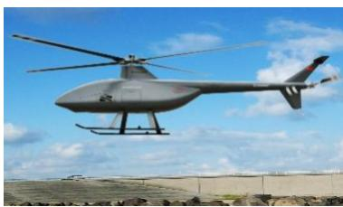

## 公司介绍COMPANY PROFILE

成都中科比智科技有限公司(简称:中科比智)作为成都高新区“岷山行动计划”首批“揭榜挂帅”新型研发机构-成都岷山综合定位导航授时技术研究院孵化的首家产业化公司，在成都高新区的产业政策扶持下，在与中国科学院国家授时中心紧密合作下，面向国家综合PNT中的“泛在无线可信PNT”方向，针对卫星导航“被干扰、被欺骗，被遮挡、被拒止”痛点，提供更可靠、更可信的干扰与抗干扰类/可信定位通信类解决方案和产品。中科比智从导航对抗（可信PNT）起步，做时空无线智能领域的领先者！

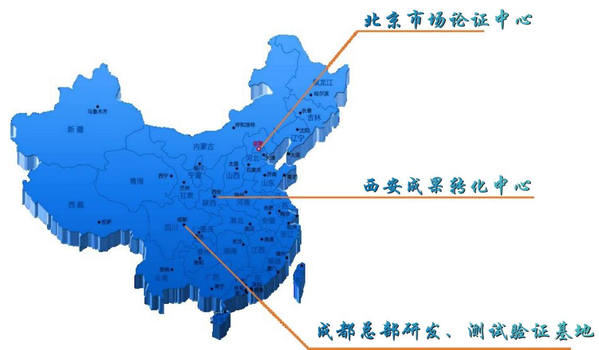

## 目录

产业布局与产品体系 01

## 系统解决方案

抗干扰与防欺骗类 02  
干扰与欺骗类 03  
集群自组网定位类 04  
自主导航类 05  
区域定位类——区域定位高精度位置服务 06  
测控通信类——地面系统 07  
测控通信类——导航与遥感数据融合应用 08

## 核心产品

I-1抗干扰与防欺骗类——可信定位授时产品 09  
I-1抗干扰与防欺骗类——授时安全防护产品 10  
I-1抗干扰与防欺骗类——干扰检测产品 11  
I-2干扰与欺骗产品 12  
II-1集群自组网定位与自主导航类产品 13  
II-2区域定位与测控通信类——测控/数传/通信产品 14  
II-2区域定位与测控通信类——区域定位授时产品 15

微波暗室测试服务 16

## 产业布局与产品体系

在综合PNT产业蓝图及国家战略体系下，公司基于多元数据融合处理与智慧应用的市场需求进行了无线可信PNT产业布局，采用综合化、软件定义一切(SDX)、人工智能与云计算等技术，赋能具有支持低时延、自组织、即插即用等处理与应用特性的PNT系列化产品，为实现具有全域覆盖、泛在接入、精准可靠、融合应用、安全可信的时空统一基准体系贡献公司的智慧和成果。

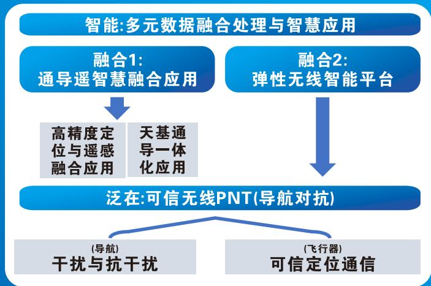

公司在无线可信PNT（导航对抗）领域的产品分为干扰与抗干扰、可信定位通信两大类四小类，实现任何时间、任何地点，各种对抗环境下的更可信、更可靠无线电导航/定位/授时与通信业务，服务国防军事及重点行业。

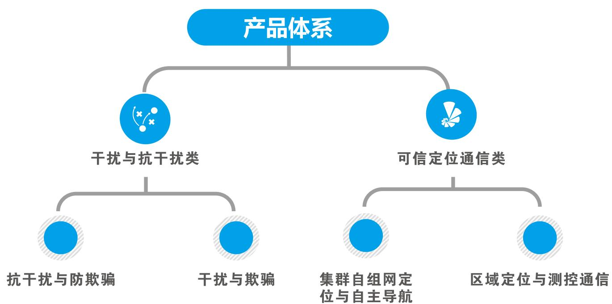

## 抗干扰与防欺骗类

面向重点区域卫星导航可信定位授时保障需求，提供专用卫星导航干扰检测与干扰源测向定位系统解决方案，具备固定、机载、车载多平台协同一体化监测、告警、隔离与干扰源测向定位排查能力，满足各类行业用户区域导航干扰防护需求。

## 主要设备

欺骗式/压制式干扰检测设备（车载/便携/机载/手持）

北斗授时安全隔离防护装置

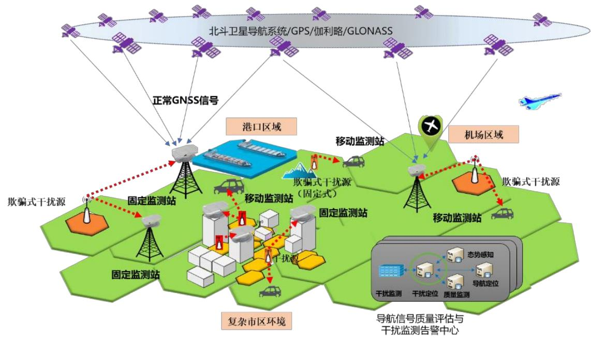

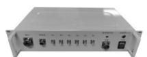  
车载型欺骗干扰 检测测向终端

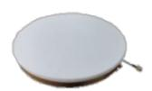

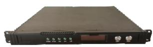  
北斗授时安全隔离防护装置

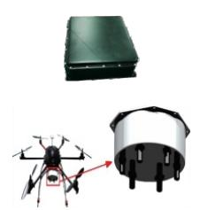  
机载型欺骗/压制干扰检测测向终端

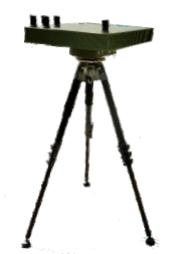  
便携式干扰 检测测向终端

## 应用场景

复杂环境下的卫星导航压制/欺骗式干扰检测

通用航空机场及重要航线附近压制/欺骗式干扰检测

城市、交通密集和高安全区域压制/欺骗式干扰检测

电网和轨道交通区域欺骗式干扰检测、导航增强及授时安全隔离等

## 干扰与欺骗类

面向重点区域非法机动目标卫星导航拒止需求，提供专用的体系化、分布式、压制欺骗多手段融合的卫导拒止系统解决方案，实现区域范围常规GNSS/抗干扰GNSS接收机的失效或诱骗功能，支持各形态、功能、性能的干扰机定制，满足各类行业用户区域非法机动目标驱离与安全防护需求。

## 主要设备

卫星导航欺骗式干扰机

导航频段压制干扰机

分布式干扰管控系统

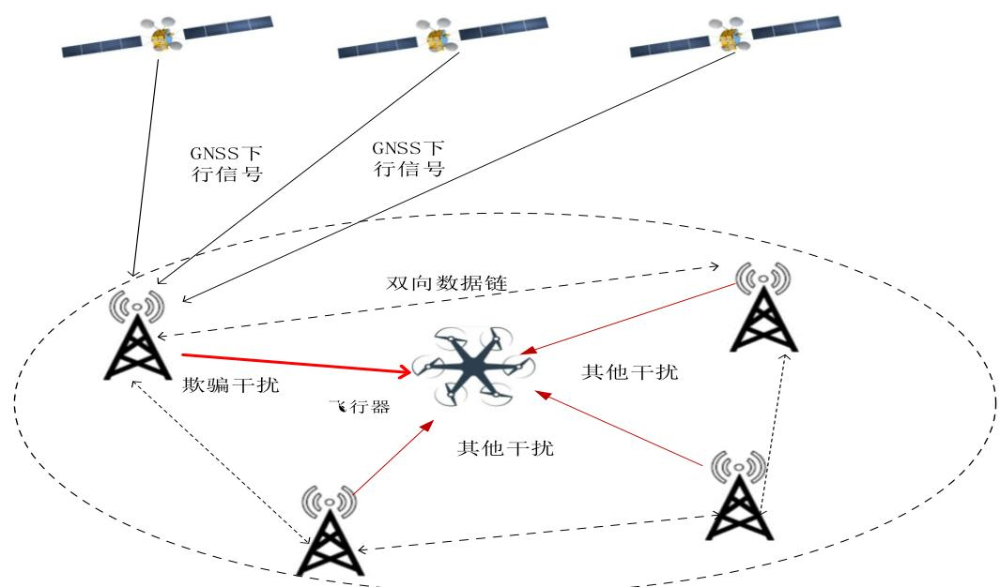

卫星信号干扰/欺骗原理

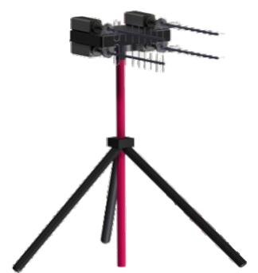  
综合化压制/欺骗干扰机

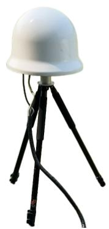  
一体化GPS欺骗干扰机

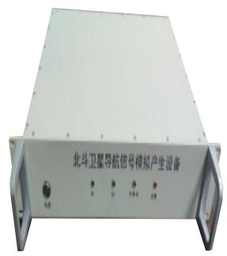

综合化干扰信号生成基带

## 应用场景

无人机拒止及空域防护

行业客户

特定需求用户

## 集群自组网定位类

提供独立于北斗又兼容于北斗导航的集群自主协同导航定位服务，在卫星导航信号弱、被欺骗、被干扰的情况下，为用户补充建设抗干扰、多手段、高精度定位授时与通信融合系统，具备独立的区域定位、授时与通信能力，为集群各类应用提供高精度时空基准。

## 主要设备

地基/空基站（空间基准）

集群自组网协同定位终端

便携式定位终端（单定位）

自组网通信终端

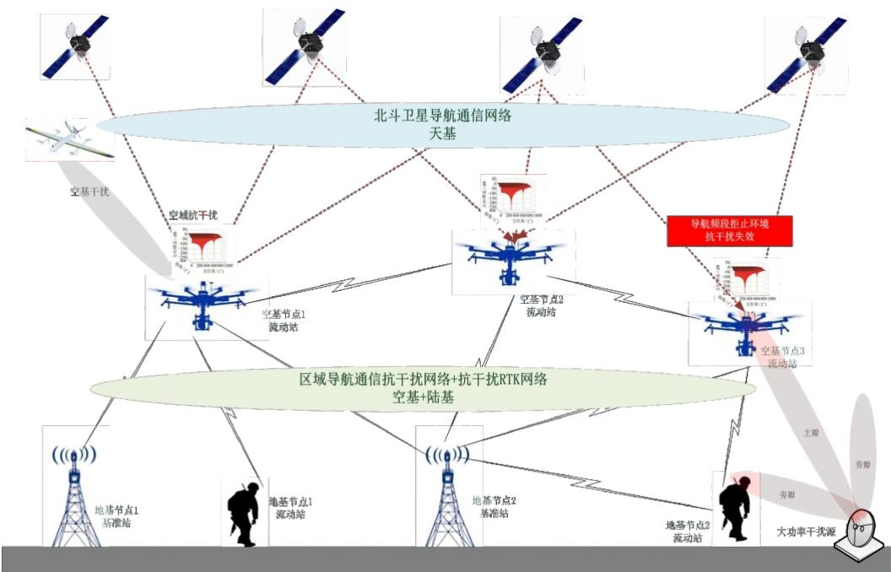  
集群自组织定位与通信系统

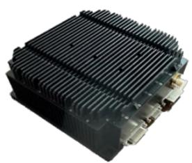  
自组网协同定位终端

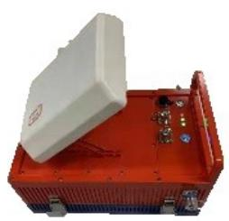  
地基主站/从站基带

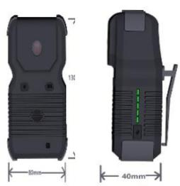  
便携式定位终端

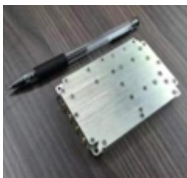  
自组网通信终端

## 应用场景

无人集群协同导航与通信

无人集群智能管理与控制

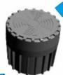

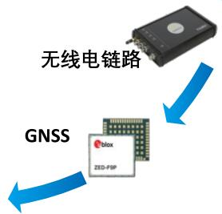  
便携式组合导航终端

## 自主导航类

提供包含卫导、视觉、地磁、惯导等多种自主导航定位能力的组合导航产品，支持无卫星导航又兼容于卫星导航的自主导航能力，满足各类用户在复杂环境条件下的高精度自主导航与定位应用需求。

## 主要设备

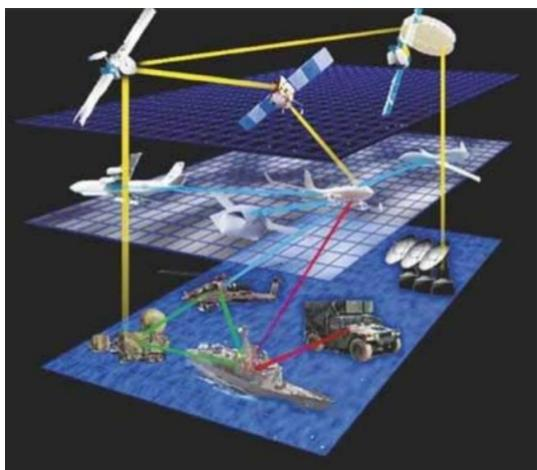  
标准化组合导航终端  
一体化自主导航终端  
边缘计算

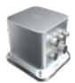  
惯性导航  
地磁传感  
激光雷达

  
数据融合人工智能  
更加泛在的多源自主导航系统

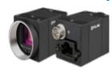  
巡飞平台  
视觉传感

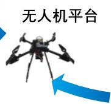  
无人机平台  
自主导航应用场景  
无线电链路

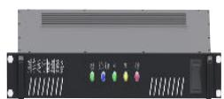

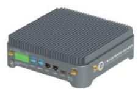  
标准化组合导航终端

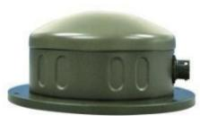

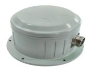  
一体化自主导航终端

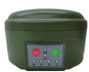

  
便携式组合定位终端

## 应用场景

无卫星导航场景的自主导航与定位

卫导增强组合定位与授时应用

## 区域定位类——区域定位高精度位置服务

面向各行业的高精度位置服务需求，提供通用化RTK定位，低成本、广覆盖PPP-RTK低动态定位，抗干扰、区域自组织RTK定位等终端产品，以CORS网络体系结构为基础，建立精确的差分信息解算模型，通过多种数据通信模式将差分数据发送给用户，进行高精度GNSS基线解算，实现毫米级定位，满足各行业应用场景下的高精度定位。

## 主要设备

通用化GNSS接收机

一体化GNSS接收机

RTK/PPP-RTK定制化产品与服务

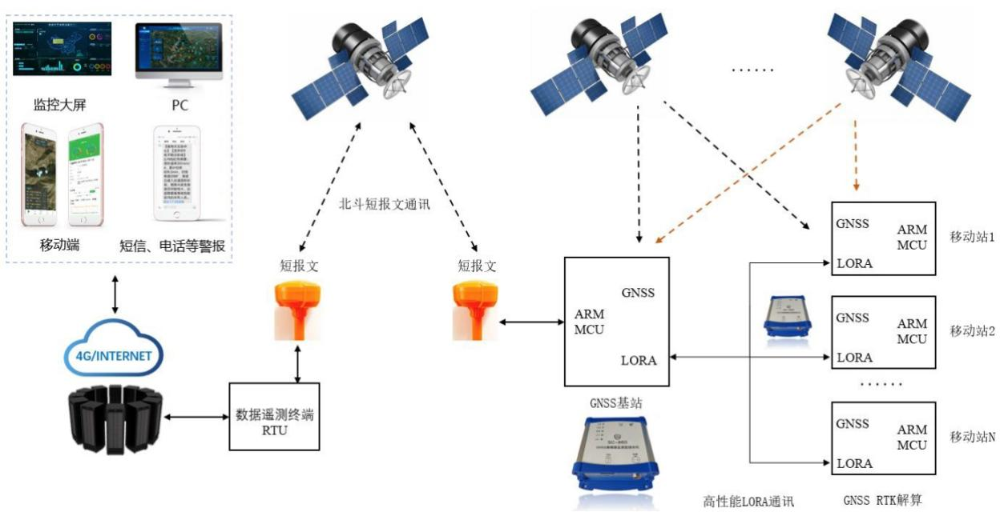  
基于北斗短报文的GNSS接收机（RTK模式）数据采集及传输原理

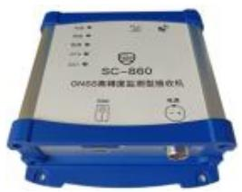  
RTK终端

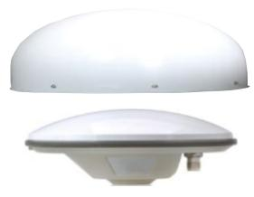  
蝶形天线  
分体化GNSS接收机

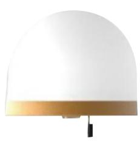  
接收机正面

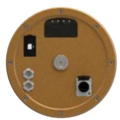  
接收机底部  
一体化GNSS接收机

## 主要设备

适用于边坡、大坝、尾矿、桥梁、楼宇、基坑等各种形变监测。

## 测控通信类——地面系统

提供多种形态的（固定、车载、船载等）地面测控站、遥感数传接收站、高/低轨卫星通信信关站、区域自主定位等系统的全套解决方案，涵盖总体设计、指标论证、工程实施、海外落地、设备开发与系统运维等全流程，支持卫星、导弹/火箭、无人机等飞行器的跟踪定位、遥测遥控、卫星通信、遥感数传、区域自主导航定位等功能。

## 主要设备

固定、机动、便携多类型整站定制化系统

功放与射频信道

卫星授时与测向

站/设备监控系统

联试应答机（模拟器）

跟踪与标校测试

数传基带

测控基带

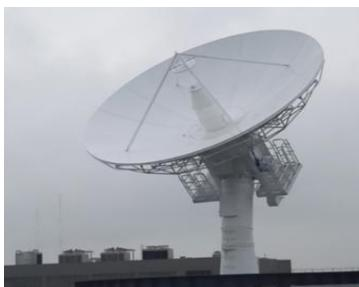

7.3米地面测控数传站

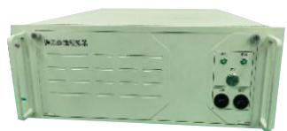  
遥测终端模拟器

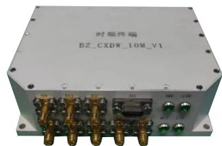

卫星授时与测向终端

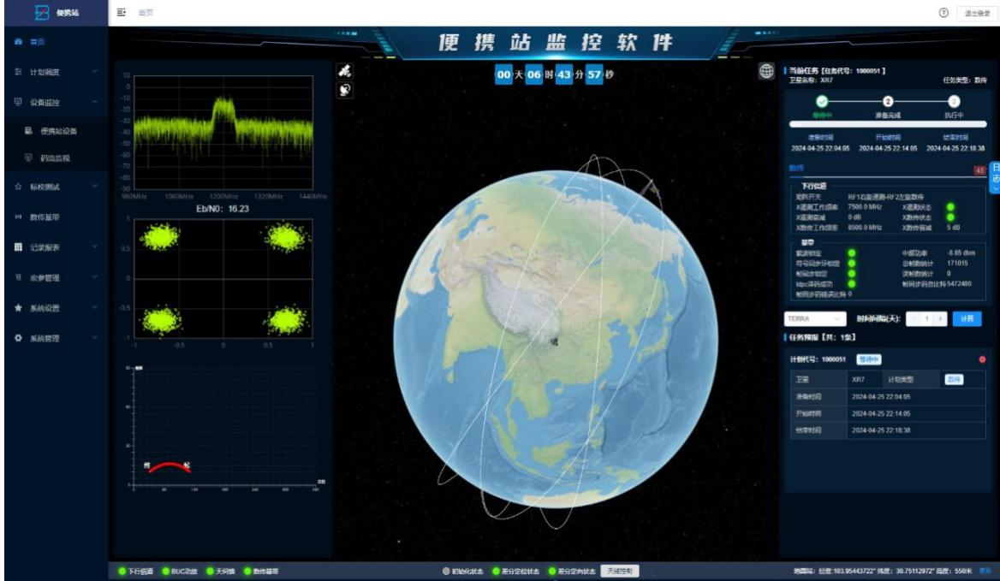  
站/设备综合管控系统

## 应用场景

低轨遥感卫星数传及业务测控

商业航天低轨信关站

飞行器遥测与试验系统

## 测控通信类——导航与遥感数据融合应用

围绕卫星导航与遥感融合应用发展方向，基于自主可控的多源卫星观测数据等资源，结合大数据、云计算和人工智能技术，为政府、企业和行业部门提供集数据采集、存储、管理、分析、可视化、预警及决策支持于一体的一站式行业应用解决方案和综合信息可视化平台。

## 主要设备

高分辨率遥感影像

专题地理信息产品和报告

  
行业可视化平台

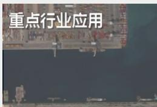

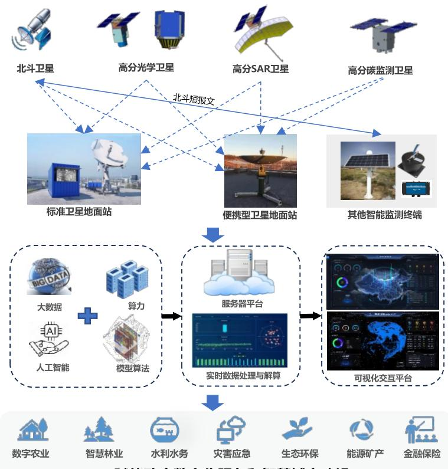  
赋能政府数字化服务和智慧城市建设  
导航与遥感融合应用解决方案

## 应用场景

数字农业：农作物病虫害及洪涝灾害监测，农作物种植面积、长势及产量预估，农作物倒伏监测，基本农田侵占监测，农业资源的规划、开发和利用；

智慧林业：森林资源普查和动态分析，林地违规占用和森林盗伐监测，森林火灾监测，森林病虫害监测与预警管理；

水利水务：水利灾害防御，水利工程监管，水生态保护，水利资源普查与保障，自来水管网探漏；

灾害应急：旱涝灾害监测，火灾监测与预警，区域地质沉降，水库大坝形变监测；

生态环保：大气环境监测，水环境监测，土壤环境，环境修复监测；

能源矿产：可再生能源动态监测，如风电、光伏、光热建设及运营观测；能源项目建设进度和设施完整性监测，动态原油库存和供应链监测，油气田沉降监测，非法采矿监测，矿区形变监测；

金融保险：在建项目进度监测，生态环境影响，项目运营跟踪，突发事件预警，抵质拥品风险管理，资产风险监测。

## I-1抗干扰与防欺骗类——可信定位授时产品

面向卫星导航应用领域，提供抗干扰、防欺骗可信PNT产品，具备压制干扰、欺骗干扰存在情况下的可信定位与授时能力，支持机动平台测向、测姿与差分RTK功能扩展，满足行业用户复杂电磁环境下的可信定位授时服务需求。

## 主要设备

抗干扰防欺骗测向测姿RTK接收机

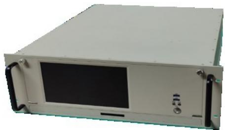  
接收机  
传统抗干扰接收机

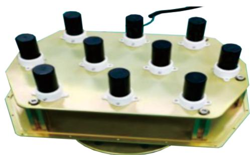  
天线  
抗干扰防欺骗测向测姿RTK接收机

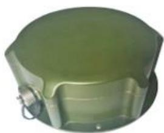

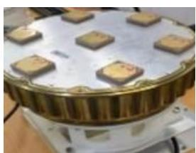  
传统GNSS抗干扰接收机

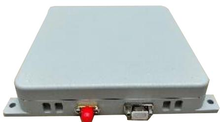  
小型化双频四阵元抗干扰接收机

传统抗干扰接收机

## 应用场景

固定平台可信定位授时

机动平台可信定位与授时（支持测向/测姿）

固定及机动平台干扰告警

## I-1抗干扰与防欺骗类——授时安全防护产品

面向卫星导航授时高可信应用需求，提供抗干扰、防欺骗等功能于一体的卫星导航时空安全隔离装置，对常规导航欺骗干扰、压制干扰信号进行有效识别及隔离，并提供可信的卫星导航信号，保障授时系统安全，设备广泛应用于电力、移动通信、金融、机场、车站等强依赖卫星授时基础服务的应用领域。

## 主要设备

北斗授时安全隔离防护装置

GPS/BD信号接收设备

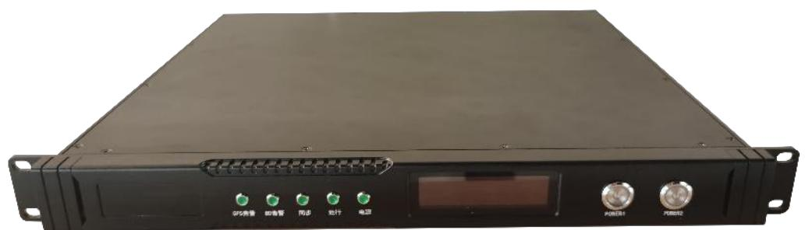

北斗授时安全隔离防护装置

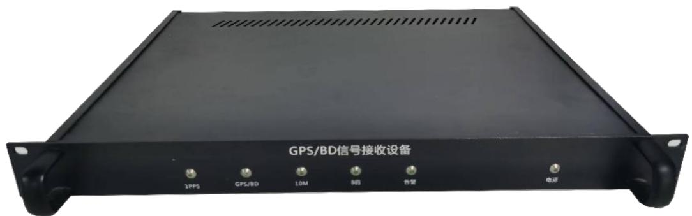

GPS/BD信号接收设备

## 应用场景

特定区域卫星导航授时安全防护

干扰告警与识别

## I-1抗干扰与防欺骗类——干扰检测产品

面向卫星导航定位、授时等高可信应用需求，提供区域性的卫星导航干扰感知、频谱监测干扰源测向定位等功能于一体的空/地基干扰检测产品，覆盖卫星导航应用频段（可按需扩展），适配车载、机载、固定等各类应用平台，形成系列化、综合化、多体制、跨平台产品型谱。

## 主要设备

车载型欺骗干扰检测测向终端

机载型欺骗/压制干扰检测侧向终端

便携式干扰检测测向终端

船载型综合干扰检测测向终端

星载欺骗/压制干扰综合检测测向终端

手持式干扰检测测向终端

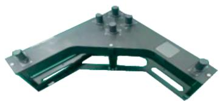

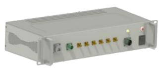

  
车载型欺骗干扰检测测向终端

  
船载型综合干扰检测测向终端

  
机载型欺骗/压制干扰检测测向终端  
星载欺骗/压制干扰综合检测测向终端

  
便携式干扰检测测向终端

  
手持式干扰检测测向终端

## 应用场景

干扰感知与区域防护

干扰监测与定位（铁路、民航、移动通信、电网等）

## I-2干扰与欺骗产品

面向卫星导航区域高效拒止、反无及其他飞行器导航对抗应用需求，提供集欺骗干扰、压制干扰、复杂电磁干扰多功能于一体的导航拒止干扰系统，具有大功率压制干扰、灵巧式欺骗于扰及分布式干扰等多类型干扰手段，可实现对各类卫星导航终端的高效拒止，形成系列化、综合化、多体制产品型谱。

## 主要设备

一体化GPS欺骗干扰机

综合化压制/欺骗干扰机

  
一体化GPS欺骗干扰机

欺骗干扰信号生成基带

欺骗干扰信号生成板卡

  
综合化压制/欺骗干扰机

  
欺骗干扰信号生成板卡

  
欺骗干扰信号生成基带

## 应用场景

卫星导航对抗/拒止（含抗干扰接收机）

无人机诱骗迫降（安防/机场）

阵地安全防护等

## II-1集群自组网定位与自主导航类产品

面向无人集群协同定位与数据交互应用等需求，提供集群节点间相对测距与时间同步等服务，具备集群区域自主时间同步与维持能力，支持与GNSS/惯导/光学定位数据融合的集群绝对定位与自主导航定位，为集群协同智能管控提供时空基准服务。

## 主要设备

集群自组网协同定位终端

固定锚点设备

飞行器图传数据链终端

自主导航终端

固定锚点绝对导航锚点

其余节点相对导航锚点

  
时空基准协同定位架构双向链路

  
集群自组网协同定位终端

  
固定锚点设备

  
飞行器图传数据链终端

  
自主导航终端（机动锚点）GNSS+惯导+相机

## 应用场景

复杂电磁环境下协同组网及自主导航定位通信无人装备协同导航定位通信

## II-2区域定位与测控通信类——测控/数传/通信产品

面向低轨卫星、无人机等飞行器的测控、数传、通信与定位功能需求，提供覆盖S/C/X/Ka/Q/V各频段的多体制、多功能、多平台的整站及单机（射频信道、基带、标校测试、站控软件、信号处理板卡）型谱产品并支持定制化扩展。

## 主要设备

固定型/车载型/便携型测控、数传、通信站（含单机产品）

  
7.3米地面测控数传站

  
4.5米车载测控数传站

  
1.5米Ka频段信息上行站

  
便携地面测控站

  
1.2米X频段便携卫星 测控数传一体化终端

## 应用场景

低轨遥感卫星数传及业务测控商业航天通信卫星信关站

便携通信终端站无人机测控数传站

## II-2区域定位与测控通信类——区域定位授时产品

提供高精度、通用化、低成本RTK定位授时终端，地基导航授时自组网终端，光电一体化信标测试终端等产品，满足各类行业应用场景下的高精度导航定位及授时应用服务需求。

## 主要设备

RTK终端

授时终端

  
RTK终端  
地基导航授时系统

  
地基导航授时终端  
光电标校载荷

  
光电标校载荷

  
地基导航授时系统原理

  
地基主站/从站天线

  
地基主站/从站基带

## 应用场景

形变监测

区域自主授时定位

标校测试（测控/雷达/通信大天线外场）

# 微波暗室测试服务

公司建设了经专业机构鉴定通过的微波暗室，是公司开展技术研究与产品生产、测试的基础设施之一，该暗室同时具备为行业客户提供装备、整机以及模块测试服务的资质。

具备曲面天线/天线子阵远场、近场数据采集能力

适应平面和曲面天线、天线子阵的测试和标校能力

支持收发态幅度方向图、相位方向图、收发功能校准、单通道校准、和差方向图、模拟、数字相控阵天线单元阵子的标校等电性能参数的自动化测试

球面相控阵及平面相控阵标校采用高精度6轴进口机械臂，结合我司自主研发的球坐标/柱坐标/平面坐标定位系统，以及对机械臂进行补偿，用户通过直观的坐标系就能够定位到球面/平面相控阵单元。

0.75-40GHz标准增益喇叭组件(经国家二级标准计量认证单位测定)

尺寸:10m\*5m\*5m

系统远场测试频率:0.8-40GHz

系统近场测试频率:2-18GHz

测试系统类型:平面近场、球面近场、远场

平面近场行程:1.8m\*1.8m

平面度:优于0.1mmRMS

球面近场可测被测件尺寸重量:球面天线不大于直径1m被测件重量不大于150KG

## 欺骗式/压制式干扰检测设备

欺骗式干扰检测设备主要提供针对转发式、再生式等导航欺骗式干扰的空域监测、检测、识别与测向功能。设备由GNSS干扰监测测向设备主机以及检测天线组成，可搭载于车载平台或固定平台上，为各类平台提供欺骗式干扰的检测预警以及干扰源测向定位功能。

全新的多峰捕获跟踪技术，支持欺骗式干扰信号的信号层监测与识别

融合的信号特征与空域特征监测技术，支持各类欺骗式干扰信号的多域特征联合监测

多元的测向定位技术，支持多手段多尺度欺骗式干扰源测向、定位功能

欺骗式干扰源监测灵敏度与GNSS接收机相同，检测灵敏度高

支持欺骗式干扰环境下准确定位与授时

支持干扰源全自动定向与多点定位

## 主要功能

欺骗式干扰信号检测识别功能，支持转发式和生成式两种欺骗模式，支持GPSL1/北斗B1I/B1C等欺骗信号(可扩展其他频段)

指定频段内欺骗干扰源测向功能，输出测向结果的基准方向为真北方向或本体坐标系方向区域导航性能评估与监测

导航欺骗干扰检测、测向信息实时显示功能

历史欺骗干扰检测、测向和定位结果信息导入、显示功能

电子地图显示功能

欺骗干扰告警的功能

通用网口的数据传输与管控功能

## 车载型欺骗干扰检测测向终端

机载型欺骗/压制干扰检测测向终端

<table><tr><td>项目</td><td>主要参数</td></tr><tr><td>干扰监测更新频率</td><td>1Hz</td></tr><tr><td>监测灵敏度</td><td>≤-124dBm</td></tr><tr><td>欺骗干扰测向精度</td><td>≤8°(精测);≤20°(粗测)</td></tr><tr><td>检测时间(欺骗式干扰告警时间)</td><td>≤1分钟</td></tr><tr><td>设备功耗(含天线)</td><td>≤50W</td></tr><tr><td>工作温度</td><td>+5°C~+40°C(室内),-25°C~+60°C(室外)</td></tr><tr><td>存贮温度</td><td>-55°C~+70°C</td></tr><tr><td>设备规格</td><td>标准2U机箱</td></tr></table>

## 欺骗式/压制式干扰检测设备

## 应用场景

通用航空机场及重要航线附近欺骗式干扰监测

固定站7x24小时连续监测告警

干扰源方向实时跟踪

机动站重点区域高效监测与定位

4/5G网络远程上报与集中式管理

城市和交通密集和高安全区域欺骗式干扰监测固定站7x24小时连续监测告警便携式终端近距离测向定位机动站中远程单机多点测向定位全频点/全模式区域感知多手段远程上报与广域感知

电网和轨道交通区域欺骗式干扰监测

固定站7x24小时连续监测告警

机动站中远程单机多点测向定位

抗欺骗可靠授时与定位

多手段远程上报与广域感知

战场环境下的卫星导航欺骗式干扰监测固定站7x24小时连续监测告警多机动站协同监测与定位站间多手段数据交互与高效调度抗欺骗高可靠定位授时全频点/全模式联合感知

## 北斗授时安全隔离防护装置

北斗授时安全隔离防护装置用于电力电网、移动通信网络等对时空安全有保障需求的领域。装置将在轨导航卫星与授时系统进行有效隔离，确保影响授时安全的干扰信号无法输入至授时系统并保障授时系统持续稳定运行。装置与现有电力系统的授时设备直接兼容，安装在授时设备与导航卫星信号接收天线之间，实时监测在轨导航卫星信号的健康程度，主动识别并隔离干扰信号，保持授时信号持续高精度同步，使授时设备接收到的授时信号连续可靠，提升授时系统的安全性、稳定性和抗攻击能力。

直接兼容电力系统等多个行业现有授时设备，即插即用

支持多种导航卫星信号频点接收能力，提高信号接收可靠性

具备多种时间同步、星历采集、导航卫星信号选通策略，保障装置独立工作能力

导航卫星信号监测:实时监测并分析导航卫星信号的完好性和可用性

授时安全告警:监测到干扰信号或导航卫星信号不可用时，进行告警，异常告警时间≤15s，解除告警时间≤180s

干扰信号隔离:自动隔离非安全的GPS-L1、BDS-B1信号，保持高精度时间同步能力

卫星时空安全隔离装置

## 功能指标

## 远程指挥调度功能

1.远程监控:支持远程工况监测、控制功能，支持在原监控平台上集成隔离装置监控系统

2.事件上报与存储:自动上报并存储导航卫星信号异常事件，识别信号异常事件类型

## 导航卫星信号接收能力

GPSL1、L2，BDSB1、B2、B3，GLONASSL1、L2

## 导航卫星信号输出能力

1.选配频点:GPSL1、BDS B1

2.选配频点:GLONASSL1、Galileo E1、BDSB3I

3.信号输出功率范围:-125--90dBm

## 对外授时功能

具备NTP授时、1PPS+TOD授时、B码授时功能

## 防欺骗性能

防转发式、生成式欺骗，防压制干扰信号

## 多工作模式(可选配)

1.同步保持模式:当存在安全的导航卫星信号频点可用于时间同步时，启用同步保持模式，输出信号同步精度:≤100ns

2.拒止维持模式:当导航卫星信号完全不可用时，启用拒止维持模式，时间维持精度优于500ns，维持时间≥1h(标配).维持时间≥2h(选配)、维持时间≥6h(选配)

## 应用场景

  
电力电网行业

  
移动通信行业

  
数据中心

## 无人机导航通信数据链接

无人机导航通信数据链接通过机载终端与地面终端为无人机提供远/中/近程测控通信业务，机载终端搭载于飞机平台并支持多类型飞控接口与协议，地面系统采用天线基带一体化设计，支持远程网络控制与管理。测控链路采用OFDM通信波形，支持测控/图传综合化链路服务。系统硬件采用成熟的机地通用软件无线电平台，系统软件核心算法成熟可靠，外围接口、结构可根据用户业务需求定制，如链路协议、无人机终端结构尺寸及飞控数据接口及协议、地面设备形态等。

L频段链路覆盖

全向测控/定向图传无感切换

测控图传链路一体化

开放的数据接口、链路协议、物理形态

## 主要功能

机地低速遥测接收处理

高低速码率自适应调整

机地低速遥控指令上注

航迹装订与监控

机地图传

地面网络数据传输与分发

目标程序跟踪与实现显示

机载测控通信终端

  
地面便携测控站

## 无人机导航通信数据链接

<table><tr><td colspan="2">项目</td><td>主要参数</td></tr><tr><td rowspan="7">系统指标</td><td>工作频率</td><td>L频段</td></tr><tr><td>作用距离</td><td>≥20km</td></tr><tr><td>调制体制</td><td>OFDM(上行/下行)</td></tr><tr><td>上行遥控速率</td><td>≤25.6kbps</td></tr><tr><td>下行遥测速率</td><td>≤25.6kbps</td></tr><tr><td>下行图传速率</td><td>≤4Mbps</td></tr><tr><td>运行模式</td><td>远程、本地监控,支持自动化运行</td></tr><tr><td rowspan="5">机载设备</td><td>天线</td><td>垂直极化;水平全向,增益≥-1dB;俯仰波束宽度大于85°</td></tr><tr><td>终端</td><td>体积120*70*32;重量≤400g;功耗≤15W(典型1W功放);发射功率1W以</td></tr><tr><td>数据接口</td><td>太网接口</td></tr><tr><td>控制接口</td><td>422</td></tr><tr><td>工作温度</td><td>-40°C~55°C</td></tr><tr><td rowspan="4">地面便携站</td><td>天线</td><td>垂直极化;方位全向,俯仰余割赋形天线,增益≥10dB;3dB波束宽度方位:水平全向,俯仰:30°~40°</td></tr><tr><td>地面终端</td><td>体积300*300*60;重量≤5Kg;功耗≤15W(典型1W功放)</td></tr><tr><td>控制与数据接口</td><td>以太网接口</td></tr><tr><td>工作温度</td><td>-20°C~55°C</td></tr></table>

# GNSS毫米级一体化变形监测接收机

面对泛在变形监测应用市场的一款毫米级一体机化监测接收机，支持BDS、GPS、Galileo、GLONASS等多系统、多频点，支持PPP和RTK算法，可以提供稳定的高质量原始观测量输出以及毫米级变形监测预警服务。

## 主要功能

毫米级定位解算，支持PPP和RTK算法。

兼容卫星通信+移动通信。

低功耗，整机平均功耗小于2W。

通电自启，开机自动连接平台，全天候自动化监测。

内嵌工业级智能平台，具有查询访问、监测预警功能。

支持远程配置和串口命令主机参数设置，固件升级。

支持自身运行状态信息监控。

## 主要参数

采样频率：可配置，最高10Hz；数据格式：RTCM32

首次定位时间：热启动30s，冷启动45s

重捕获时间L1/L2：0.5/1.0sec

存储空间：32G

测量精度水平：±3mm+0.5ppm RMS；垂直：±5mm+0.5ppm RMS

解算模式：实时

基准点距测点最大距离（D）：10km

通讯端口有线通讯：RJ45/RS232

通讯组网方式：网线、光纤

系统供电：DC12V

功耗整机功耗： $< 2 W$

工作温度： $- 4 0 ^ { \circ } \mathsf { C } \sim + 8 5 ^ { \circ } \mathsf { C }$

## 应用场景

适用于各类场景的放在变形监测，包含边坡，大坝，尾矿，桥梁，楼宇，基坑等各种变形监测。

## 室内定位+数据链

## 室内定位授时设备

## 产品介绍

在高速公路、高速铁路的各种大型隧道以及城市地铁线路中，对定位精度要求不苛刻，但是目前尚无有效低成本定位授时方案。传统蘑菇头放大方案，无法在隧道和地铁线路中提供精确地理位置。本系统采用自主知识产品的室内伪卫星授时技术，分为近端主机，远端主机两部分。近端主机接收室外导航信号，通过光纤连接远端主机，远端主机通过伪卫星技术实现室内定位。

定位精度≤1\~10m 授时精度≤100ns 可提供远端云服务进行维测

可自动补偿传输时延

可利旧已有光纤网络，不需要额外布线

## 光纤拉远室内BBU授时

光纤拉远室内BBU授时运营商在地铁站、机场大厅、高铁站等封闭空间机房内部，需要对BBU设备进行授时。

传统GNSS模拟放大方案具备布线难、延迟补偿难、维测困难等痛点。

本系统采用自主知识产品的室内伪卫星授时技术，分为近端主机、远端主机两部分，近端主机接收室外GNSS信号，并通过光纤与远端主机相连，远端主机通过伪卫星技术对BBU系统进行授时。相对于传统模拟方案，该方案具备如下特点:支持外接抗干扰天线主机 光纤传输示章图

授时精度≤100ns

定位精度≤2m

可提供BBU位置信息

可利旧已有光纤网络，不需要额外布线

## 飞行器图传数据链终端

## 飞行器图传数据链应用

D数据链传输：图传+姿态

高性能

低延迟

  
无人机数据链传输：图传+飞控

图传+数传

抗干扰

自组织

## 室内定位+数据链

## 主要技术指标

支持CVBS接口，分辨率720x576

支持RS-422，默认115.2bps，可修改

工作频率范围:1100\~1500MHz。可定制

工作距离:≥20km，可扩展至100km

供电:DC24\~28V

功耗:≤7W@1W功放(Max50W@20W功放)

尺寸:≤85mmx65mmx25mm

重量:≤210g

工作温度:-40℃\~+60℃

支持高动态(≥10马赫)

支持远距离(≥100km)

支持图像延迟≤180ms

支持数据延迟≤20ms

支持CVBS、SDI输入输出

支持720P、1080P图像压缩、解压缩

支持跳频、自适应频率选择

支持1主多从控制

支持节点自适应中继

时间终端  

具备溯源、同步、定位、授时、守时等功能，可作为小型时频同步系统的时频源。具备北斗/GPS卫星、IRIG-B(DC)等溯源方式，具有B(DC)、NTP、1PPS+TOD等授时方式，具有晶振驯服、自主守时的功能，还具备人机交互、网管、日志输出等功能。

<table><tr><td>项目</td><td>类别</td><td>规格</td></tr><tr><td rowspan="4">输入信号</td><td>北斗</td><td>共用1路</td></tr><tr><td>10MHz</td><td>1路</td></tr><tr><td>B(DC)</td><td>1路</td></tr><tr><td>B(AC)</td><td>1路</td></tr><tr><td rowspan="7">输出信号</td><td>1PPS</td><td>4路(路数可选)</td></tr><tr><td>TOD</td><td>4路(路数可选)</td></tr><tr><td>B(DC)</td><td>4路(路数可选)</td></tr><tr><td>B(AC)</td><td>2路(路数可选)</td></tr><tr><td>10MHz</td><td>1路(路数可选)</td></tr><tr><td>百兆NTP</td><td>1路</td></tr><tr><td>百兆PTP</td><td>1路</td></tr><tr><td rowspan="2">其他接口</td><td>调试串口</td><td>1路</td></tr><tr><td>百兆监控</td><td>1路</td></tr><tr><td rowspan="3">环境适应性</td><td>工作温度</td><td>-25°C~+55°C</td></tr><tr><td>储存温度</td><td>-55°C~+70°C</td></tr><tr><td>相对湿度</td><td>10%~95%</td></tr><tr><td>外观结构</td><td>尺寸</td><td>19英寸1U标准设备</td></tr><tr><td rowspan="2">电气特性</td><td>电源</td><td>AC220V(1±10%), 50Hz(1±5%)</td></tr><tr><td>功耗</td><td>&lt;15W</td></tr></table>

网络时间服务器  

以网络授时设计为主，可作为网络中心站的时间同步源。具备北斗/GPS卫星、IRIG-B(DC)、1PPS+TOD等溯源方式，具有多路PTP、NTP授时网口，具有晶振驯服、自主守时的功能，还具备人机交互、网管等功能。

<table><tr><td>项目</td><td>类别</td><td>规格</td></tr><tr><td rowspan="4">输入信号</td><td>北斗/GPS</td><td>共用1路</td></tr><tr><td>10MHz</td><td>1路</td></tr><tr><td>B(DC)</td><td>1路</td></tr><tr><td>1PPS+TOD</td><td>1路</td></tr><tr><td rowspan="2">输出信号</td><td>NTP</td><td>2路</td></tr><tr><td>PTP</td><td>2路</td></tr><tr><td rowspan="2">其他接口</td><td>调试串口</td><td>1路</td></tr><tr><td>监控</td><td>1路</td></tr><tr><td rowspan="3">环境适应性</td><td>工作温度</td><td>-25°C~+55°C</td></tr><tr><td>储存温度</td><td>-55°C~+70°C</td></tr><tr><td>相对湿度</td><td>10%~95%</td></tr><tr><td>外观结构</td><td>尺寸</td><td>19英寸2U标准设备</td></tr><tr><td rowspan="2">电气特性</td><td>电源</td><td>AC220V(1±10%), 50Hz(1±5%)</td></tr><tr><td>功耗</td><td>&lt;30W</td></tr></table>

## 时间终端

标准时间服务器  

覆盖最全面的时统功能和最优的时统性能，其后面板采用插卡设计用户可灵活配置授时信号路数。

<table><tr><td>项目</td><td>类别</td><td>规格</td></tr><tr><td rowspan="4">输入信号</td><td>1PPS+TOD</td><td>1路</td></tr><tr><td>B码</td><td>1路</td></tr><tr><td>E1</td><td>1路</td></tr><tr><td>PTP</td><td>1路</td></tr><tr><td rowspan="7">输出信号</td><td>1PPS</td><td>2路</td></tr><tr><td>TOD</td><td>2路</td></tr><tr><td>B码</td><td>2路</td></tr><tr><td>千兆PTP</td><td>1路</td></tr><tr><td>千兆NTP</td><td>1路</td></tr><tr><td>E1</td><td>1路</td></tr><tr><td>10MHz</td><td>1路</td></tr><tr><td>其他接口</td><td>千兆监控</td><td>1路</td></tr><tr><td rowspan="2">环境适应性</td><td>工作温度</td><td>-25°C~+55°C</td></tr><tr><td>储存温度</td><td>-55°C~+70°C</td></tr><tr><td>外观结构</td><td>尺寸</td><td>19英寸1U标准设备</td></tr><tr><td rowspan="2">电气特性</td><td>电源</td><td>DC+24V</td></tr><tr><td>功率</td><td>&lt;30W</td></tr></table>

## 卫星共视设备

在具备溯源、同步、定位、授时、守时等功能的基础上，采用高精度卫星共视算法，实现站间同步精度优于5ns。此外还具备人机交互、网管、日志输出等功能。

<table><tr><td>项目</td><td>类别</td><td>规格</td></tr><tr><td rowspan="2">输入信号</td><td>GPS/北斗</td><td>共用1路</td></tr><tr><td>10MHz</td><td>1路</td></tr><tr><td rowspan="4">输出信号</td><td>1PPS</td><td>2路</td></tr><tr><td>TOD</td><td>2路</td></tr><tr><td>B(DC)</td><td>2路</td></tr><tr><td>10MHz</td><td>2路</td></tr><tr><td rowspan="2">其他接口</td><td>调试串口</td><td>1路</td></tr><tr><td>监控</td><td>1路</td></tr><tr><td rowspan="2">环境适应性</td><td>工作温度</td><td>-25°C~+55°C</td></tr><tr><td>储存温度</td><td>-55°C~+70°C</td></tr><tr><td>外观结构</td><td>尺寸</td><td>19英寸2U标准设备</td></tr><tr><td rowspan="2">电气特性</td><td>电源</td><td>AC220V(1±10%), 50Hz(1±5%)</td></tr><tr><td>功率</td><td>&lt;50W</td></tr></table>

专用车载时频设备  

产品进行抗振强化设计和网络功能性能升级（包括千兆NTR千兆PTPPTPoverE1等)，更好的满足车载振动场景下的高精度授时。

<table><tr><td>项目</td><td>类别</td><td>规格</td></tr><tr><td rowspan="4">输入信号</td><td>1PPS+TOD</td><td>1路</td></tr><tr><td>B码</td><td>1路</td></tr><tr><td>E1</td><td>1路</td></tr><tr><td>PTP</td><td>1路</td></tr><tr><td rowspan="7">输出信号</td><td>1PPS</td><td>2路</td></tr><tr><td>TOD</td><td>2路</td></tr><tr><td>B码</td><td>2路</td></tr><tr><td>千兆PTP</td><td>1路</td></tr><tr><td>千兆NTP</td><td>1路</td></tr><tr><td>E1</td><td>1路</td></tr><tr><td>10MHz</td><td>1路</td></tr><tr><td>其他接口</td><td>千兆监控</td><td>1路</td></tr><tr><td rowspan="2">环境适应性</td><td>工作温度</td><td>-25°C~+55°C</td></tr><tr><td>储存温度</td><td>-55°C~+70°C</td></tr><tr><td>外观结构</td><td>尺寸</td><td>19英寸1U标准设备</td></tr><tr><td rowspan="2">电气特性</td><td>电源</td><td>DC+24V</td></tr><tr><td>功率</td><td>&lt;30W</td></tr></table>

## 时间终端

PTP热备服务器  

采用PTP组播最佳主钟算法进行1+N热备设计，可大大提高网络时间源的可靠性和稳定性。在具备溯源、同步、授时、守时功能的基础上，PTP热备服务器可自动协商或手动切换PTP主备模式、可设置PTP报文速率和工作参数。此外PTP热备服务器配套监控软件适配麒麟操作系统。满足车载振动场景下的高精度授时。

<table><tr><td>项目</td><td>类别</td><td>规格</td></tr><tr><td rowspan="3">输入信号</td><td>北斗/GPS</td><td>共用1路</td></tr><tr><td>10MHz</td><td>1路</td></tr><tr><td>B(DC)</td><td>2路</td></tr><tr><td rowspan="2">输出信号</td><td>PTP</td><td>1路</td></tr><tr><td>B(DC)</td><td>16路</td></tr><tr><td rowspan="3">其他接口</td><td>调试串口</td><td>1路</td></tr><tr><td>日志串口</td><td>1路</td></tr><tr><td>百兆监控</td><td>1路</td></tr><tr><td rowspan="3">环境适应性</td><td>工作温度</td><td>-25°C~+55°C</td></tr><tr><td>储存温度</td><td>-55°C~+70°C</td></tr><tr><td>相对湿度</td><td>10%~95%</td></tr><tr><td>外观结构</td><td>尺寸</td><td>19英寸1U标准设备</td></tr><tr><td rowspan="2">电气特性</td><td>电源</td><td>AC220V(1±10%),50Hz(1±5%)</td></tr><tr><td>功率</td><td>&lt;30W</td></tr></table>

PCIE时统板卡  
  
重量：<1Kg

电源: 5V(1 ± 10%)

PCI时码卡  
  
功率: <5W  
CPCI时统模块

## 时间终端

输入信号：北斗/GPS：共用 1路；B 码：1路；10MHz:1 路

输出信号：1PPS:1路；串行码：1路；BDC：1路；10MHz:2路

<table><tr><td>项目</td><td>类别</td><td>规格</td></tr><tr><td rowspan="3">环境适应性</td><td>工作温度</td><td> $-10^{\circ}C \sim +45^{\circ}C$ </td></tr><tr><td>储存温度</td><td> $25^{\circ}C \sim +70^{\circ}C$ </td></tr><tr><td>相对湿度</td><td>10%~95%</td></tr><tr><td>外观结构</td><td>板卡尺寸</td><td>20*12*3cm</td></tr></table>

<table><tr><td>项目</td><td>类别</td><td>规格</td></tr><tr><td rowspan="3">环境适应性</td><td>工作温度</td><td> $-40^{\circ}C \sim +65^{\circ}C$ </td></tr><tr><td>储存温度</td><td> $-45^{\circ}C \sim +85^{\circ}C$ </td></tr><tr><td>相对湿度</td><td>10%~95%</td></tr><tr><td>外观结构</td><td>板卡尺寸</td><td>20*12*3cm</td></tr></table>

<table><tr><td>项目</td><td>类别</td><td>规格</td></tr><tr><td rowspan="2">输出信号</td><td>100MHz</td><td>2路</td></tr><tr><td>百兆PTP/NTP</td><td>1路</td></tr><tr><td rowspan="2">其他接口</td><td>调试串口</td><td>1路</td></tr><tr><td>NET监控</td><td>1路</td></tr><tr><td rowspan="3">环境适应性</td><td>工作温度</td><td>-40°C~+65°C</td></tr><tr><td>储存温度</td><td>-45°C~+85°C</td></tr><tr><td>相对湿度</td><td>10%~95%</td></tr><tr><td>外观结构</td><td>板卡尺寸</td><td>20*15*5cm</td></tr></table>

VPX时统模块  

低功耗时统模块  
  
高精度时统模块

<table><tr><td>项目</td><td>类别</td><td>规格</td></tr><tr><td rowspan="3">输入信号</td><td>北斗/GPS</td><td>共用1路</td></tr><tr><td>B码</td><td>1路</td></tr><tr><td>10MHz</td><td>1路</td></tr><tr><td rowspan="5">输出信号</td><td>1PPS</td><td>1路</td></tr><tr><td>串行码</td><td>1路</td></tr><tr><td>BDC</td><td>1路</td></tr><tr><td>10MHz</td><td>2路</td></tr><tr><td>百兆NTP</td><td>1路</td></tr><tr><td rowspan="3">环境适应性</td><td>工作温度</td><td>-40°C~+65°C</td></tr><tr><td>储存温度</td><td>-45°C~+85°C</td></tr><tr><td>相对湿度</td><td>10%~95%</td></tr><tr><td rowspan="2">外观结构</td><td>板卡尺寸</td><td>20*15*3cm</td></tr><tr><td>重量</td><td>&lt;3kg</td></tr><tr><td rowspan="2">电气特性</td><td>电源</td><td>5V(1±10%)</td></tr><tr><td>功率</td><td>&lt;5W</td></tr></table>

<table><tr><td>项目</td><td>类别</td><td>规格</td></tr><tr><td>输入信号</td><td>北斗/GPS</td><td>共用1路</td></tr><tr><td rowspan="4">输出信号</td><td>1PPS</td><td>1路</td></tr><tr><td>串行码</td><td>1路</td></tr><tr><td>100MHz</td><td>2路</td></tr><tr><td>B码</td><td>1路</td></tr><tr><td>其他接口</td><td>调试串口</td><td>1路</td></tr><tr><td rowspan="3">环境适应性</td><td>工作温度</td><td>-20°C~+65°C</td></tr><tr><td>储存温度</td><td>-40°C~+70°C</td></tr><tr><td>相对湿度</td><td>10%~95%</td></tr><tr><td rowspan="2">外观结构</td><td>模块尺寸</td><td>40*40*15mm</td></tr><tr><td>重量</td><td>&lt;1kg</td></tr><tr><td rowspan="4">电气特性</td><td>电源</td><td>3.3V(5%精度)</td></tr><tr><td>启动功耗</td><td>&lt;1W</td></tr><tr><td>稳态功耗</td><td>&lt;0.5W</td></tr><tr><td>守时功耗</td><td>&lt;0.2w</td></tr></table>

<table><tr><td>项目</td><td>类别</td><td>规格</td></tr><tr><td rowspan="4">输入信号</td><td>北斗</td><td>1路</td></tr><tr><td>B码</td><td>1路</td></tr><tr><td>E1</td><td>1路</td></tr><tr><td>PTP</td><td>1路</td></tr><tr><td rowspan="6">输出信号</td><td>1PPS</td><td>2路</td></tr><tr><td>TOD</td><td>2路</td></tr><tr><td>B码</td><td>2路</td></tr><tr><td>千兆PTP</td><td>1路</td></tr><tr><td>千兆NTP</td><td>1路</td></tr><tr><td>E1</td><td>1路</td></tr><tr><td>其他接口</td><td>千兆监控</td><td>1路</td></tr><tr><td rowspan="2">环境适应性</td><td>工作温度</td><td>-25°C~+55°C</td></tr><tr><td>储存温度</td><td>-55°C~+70°C</td></tr><tr><td>外观结构</td><td>尺寸</td><td>6U VPX</td></tr></table>

时间终端

高精度D2D有源授时设备  
  
高精度单向无源授时设备

基于微波链路双向测距误差对消技术，实现端对端设备的精确时间同步和测距

可在空基、动态条件下，实现设备间端到端的实时、纳秒级时间同步

基于GNSS提供无源高精度授时功能

采用无通信共视技术、高精度守时技术，实现设备间纳秒级时间同步

<table><tr><td>功能</td><td>高性能授时模块</td><td>说明</td></tr><tr><td>同步精度</td><td>静态:2.5ns(峰峰值),0.4ns(RMS)</td><td>峰峰值,无遮挡动态:180km/h</td></tr><tr><td>测距精度性</td><td>静态:37.5mm(峰峰值),6mm(RMS)动态:75mm(峰峰值)</td><td>峰峰值,无遮挡动态:180km/h</td></tr><tr><td>短期稳定度</td><td>优于5e-11/s</td><td></td></tr><tr><td>频率准确度</td><td>优于3e-11</td><td></td></tr><tr><td>秒脉冲抖动</td><td>≤20ps</td><td></td></tr><tr><td>工作距离</td><td>≥2km</td><td>L波段,配置2W功放,视距传输</td></tr><tr><td>MTBF</td><td>≥2000h</td><td></td></tr><tr><td>抗震能力</td><td>≥8级</td><td></td></tr><tr><td>供电电压</td><td>DC12V,可定制</td><td></td></tr><tr><td>重量</td><td>可定制</td><td></td></tr><tr><td>工作温度</td><td>-40°C~70°C</td><td></td></tr></table>

<table><tr><td>功能</td><td>高性能授时模块</td><td>通用型授时模块</td><td>说明</td></tr><tr><td>同步精度</td><td>≤3ns(峰峰值),0.5ns</td><td>≤8ns(峰峰值),1.33ns(RMS)</td><td>开阔地</td></tr><tr><td>短期稳定度</td><td>(RMS)优于5e-12/1s</td><td>优于5e-12/1s</td><td></td></tr><tr><td>频率准确度</td><td>优于3e-13</td><td>优于3e-13</td><td>24小时</td></tr><tr><td>秒脉冲宽度</td><td>≥200s,可定制</td><td>≥200s,可定制</td><td></td></tr><tr><td>秒脉冲抖动</td><td>≤20ps</td><td>≤20ps</td><td></td></tr><tr><td>可编程频率</td><td>10M~200MHz</td><td>0M~200MHz</td><td></td></tr><tr><td>守时</td><td>1.5us@24h</td><td>10us@24h</td><td>驯服7天以上(恒温晶振守时)</td></tr><tr><td>工作温度</td><td>-40°C~70°C</td><td></td><td></td></tr><tr><td>重量</td><td>≤350g</td><td></td><td></td></tr><tr><td>相噪</td><td>10Hz@-130dBc100Hz@-150dBc1kHz@-155dBc10kHz@-160dBc</td><td>10Hz@-95dBc100Hz@-125dBc1kHz@-145dBc10kHz@-160dBc</td><td>可定制低相噪模块10Hz@-135dBc100kHz@-155dBc1kHz@-160dBc</td></tr></table>

## 功放

通用化、平台化结构●高可靠性可定制模块化设计●电压、电流告警保护●过温度、过功率、过反射保护

<table><tr><td colspan="2">L波段功率放大器</td></tr><tr><td colspan="2">电性能指标</td></tr><tr><td>工作频段</td><td>1GHz~2GHz</td></tr><tr><td>输出功率</td><td>1000瓦</td></tr><tr><td>增益平坦度(全带)</td><td> $\leqslant \pm 2dB$ </td></tr><tr><td>输入/输出驻波</td><td> $\leqslant 2$ </td></tr></table>

<table><tr><td colspan="2">S波段功率放大器</td></tr><tr><td colspan="2">电性能指标</td></tr><tr><td>工作频段</td><td>2GHz~4GHz</td></tr><tr><td>输出功率</td><td>1000瓦</td></tr><tr><td>增益平坦度(全带)</td><td> $\leqslant \pm 2dB$ </td></tr><tr><td>输入/输出驻波</td><td> $\leqslant 2$ </td></tr></table>

<table><tr><td colspan="2">C波段功率放大器</td></tr><tr><td colspan="2">电性能指标</td></tr><tr><td>工作频段</td><td>5.8GHz~6.5GHz</td></tr><tr><td>输出功率</td><td>800W/2000W</td></tr><tr><td>增益平坦度(全带)</td><td> $\le \pm 1.5dB$ </td></tr><tr><td>输入/输出驻波</td><td> $\le 1.5$ </td></tr></table>

<table><tr><td colspan="2">Ku波段功率放大器</td></tr><tr><td colspan="2">电性能指标</td></tr><tr><td>工作频段</td><td>(1)13.75~14.5GHz (2)14~14.5GHz</td></tr><tr><td>输出功率</td><td>350W/1000W</td></tr><tr><td>增益平坦度(全带)</td><td>±1dB</td></tr></table>

<table><tr><td colspan="2">Ka波段功率放大器</td></tr><tr><td colspan="2">电性能指标</td></tr><tr><td>工作频段</td><td>27GHz~31GHz</td></tr><tr><td>输出功率</td><td>250W</td></tr><tr><td>增益</td><td>≥65dB</td></tr></table>

<table><tr><td colspan="2">V波段功率放大器</td></tr><tr><td colspan="2">电性能指标</td></tr><tr><td>工作频段</td><td>47GHz~52GHz</td></tr><tr><td>增益平坦度(全带)</td><td> $\leqslant \pm 1dB$ </td></tr><tr><td>噪声功率谱密度</td><td>-150dBW/4KHz@接收带内-70dBW/4KHz@发射带内</td></tr></table>

BUC

通用化、平台化结构●高可靠性可定制模块化设计电压、电流告警保护●过温度、过功率、过反射保护

<table><tr><td colspan="2">C波段 BUC</td></tr><tr><td colspan="2">电性能指标</td></tr><tr><td>输出频率</td><td>5.845GHz~6425GHz</td></tr><tr><td>输入频率</td><td>950MHz~1450MHz</td></tr><tr><td>输出功率</td><td>800W/2000W</td></tr><tr><td>增益</td><td>≥60dB</td></tr></table>

<table><tr><td colspan="2">Ku波段 BUC</td></tr><tr><td colspan="2">电性能指标</td></tr><tr><td>输出频率</td><td>1375GHz~145GHz/14-14.5GHz</td></tr><tr><td>输入频率 ≥</td><td>950MHz~1450MHz</td></tr><tr><td>输出功率</td><td>40W/80W</td></tr><tr><td>增益</td><td>≥60dB</td></tr></table>

<table><tr><td colspan="2">Ka波段 BUC</td></tr><tr><td colspan="2">电性能指标</td></tr><tr><td>输出频率</td><td>27GHz~31GHz</td></tr><tr><td>输入频率</td><td>950MHz~1450MHz</td></tr><tr><td>输出功率</td><td>200W</td></tr><tr><td>增益</td><td> $\geqslant$ 70dB</td></tr><tr><td>增益随温度变化</td><td> $\leqslant \pm 2\text{dB}$ </td></tr></table>

<table><tr><td colspan="2">V波段 BUC</td></tr><tr><td colspan="2">电性能指标</td></tr><tr><td>输出频率</td><td>47GHz~52GHz</td></tr><tr><td>输入频率</td><td>950MHz~1450MHz</td></tr><tr><td>输出功率</td><td>500W</td></tr><tr><td>增益</td><td> $\geqslant$ 60dB</td></tr><tr><td>增益调节范围</td><td>30dB,0.5dB步进</td></tr><tr><td>增益随温度变化</td><td> $\leqslant \pm 2dB$ </td></tr></table>

站控软件

专注于低轨卫星运行控制系统软件研发和低轨卫星地面站系统建设，具备总体设计、软件研发、系统集成能力。

## 低轨卫星运行控制系统软件研发

需求申请

任务规划

载荷管理

态势显示

站网资源申请

## 低轨卫星地面站系统建设

总体设计

系统集成

运行控制、站管理、数据记录、轨迹显示、信号分析处理、仿真训练等软件

## 站管软件主体

## 站控软件

## 单站管理

单站多套天线运行状态监视(分栏显示各套天线主要的运行状态，包括接收卫星、倒计时、天线跟踪方式、指向，各通道工作状态(比如2台变频器、解调器、记录，就算2通道，绿色表示锁定、记录等)、频谱)等。

## 多站协同管理

中心可制定专门的多站协同任务，内容包含总的跟踪起止时间，参与各站天线名称、坐标、各天线计划，组播地址(用于在跟踪过程中广播各天线跟踪测角数据、AGC、频谱数据、跟踪状态等)。任务完成后，一张图即可说明多站协同任务的总的执行情况。

## 中心级运控

站网接收数据总览-与任务计划表相对应，通过图标直观显示对应天线各通道数据接收和传输情况。(没收到或者超时没传输完，标红让用户去查证)。

任务执行情况可视化展示:集中显示任务完成率，整个站网，各个站，每套天线接收各卫星的次数、接收数据量等用户关心各站天线的任务负荷情况和可用情况(无故障使用时间)等等。

## 相控阵天线产品

专注于先进相控阵天线系统相关产品的研发、生产、集成、测试，产品涵盖卫通天线、无人机测控系统、电子对抗、信号处理、微波暗室工程、微波天线近场测试系统、微波高速测试系统。

通信网络基础设施

  
5G基站  
新技术基础设施

  
人工智能  
算力基础设施

  
数据中心  
5G通信

  
物联网

  
云计算

  
智能计算中心

  
工业互联网

  
区块链

  
低轨卫星通讯  
卫星互联网

  
机载火控雷达天线

  
相控阵天线产品

双极化有源相控阵天线模块  

4通道T/R组件  
  
4x4收发组件模块

  
毫米波相控阵天线

抛物面相控阵天线  

## 数字跟踪接收机

数字跟踪接收机主要为国防军用设备服务，为天线系统的自跟踪提供跟踪信号，产品设计以“面向用户”为主导思想，服务于各种体制的跟踪接收系统。数字跟踪接收机已在多个工程项目中得到应用。随着技术水平的不断发展，设备的指标、功能及可靠性都得到了极大提高。

<table><tr><td>L频段单脉冲双通道跟踪接收机</td><td>C频段单脉冲双通道跟踪接收机</td><td>Ku频段单脉冲单通道跟踪接收机</td></tr><tr><td></td><td></td><td></td></tr><tr><td>UHF步进跟踪接收机</td><td>L频段步进跟踪接收机</td><td>X频段步进跟踪接收机</td></tr><tr><td></td><td></td><td></td></tr><tr><td>Ka/X双通道跟踪接收机</td><td>C波段扩频步进跟踪接收机</td><td>Ku波段扩频步进跟踪接收机</td></tr><tr><td></td><td></td><td></td></tr><tr><td>Ka频段扩频步进跟踪接收机</td><td>Qv频段扩频跟踪接收机</td><td>L频段跳频跟踪接收机</td></tr><tr><td></td><td></td><td></td></tr><tr><td>Ku频段跳频跟踪接收机</td><td>Ka频段跳频跟踪接收机</td><td>Qv频段跳频跟踪接收机</td></tr><tr><td></td><td></td><td></td></tr></table>

## 产品目录及主要技术指标

<table><tr><td rowspan="2">系统跟踪体制</td><td rowspan="2">工作频率</td><td colspan="2">跟踪体制</td><td rowspan="2">输入信号动态范围</td><td rowspan="2">载波捕获时间</td></tr><tr><td>残留载波调制体制</td><td>无残留载波调制体制</td></tr><tr><td>单脉冲单通道O/π调制跟踪</td><td>70MHz</td><td>信标/PCM-BPSK-PM/PCM-QPSK-FM等</td><td>QPSK/BPSK/UQPSK/8PSK/16QAM等</td><td>50dB/60dB</td><td>1s</td></tr><tr><td>单脉冲单通道四相调制跟踪</td><td>70MHz</td><td>信标/PCM-BPSK-PM/PCM-QPSK-FM等</td><td>QPSK/BPSK/UQPSK/8PSK/16QAM等</td><td>50dB/60dB</td><td>1s</td></tr><tr><td>单脉冲单通道扩频O/π调制跟踪</td><td>70MHz</td><td>信标/PCM-BPSK-PM/PCM-QPSK-FM等</td><td>QPSK/BPSK/UQPSK/8PSK/16QAM等</td><td>50dB/60dB</td><td>1s</td></tr><tr><td>单脉冲单通道频四相调制跟踪</td><td>70MHz</td><td>信标/PCM-BPSK-PM/PCM-QPSK-FM等</td><td>QPSK/BPSK/UQPSK/8PSK/16QAM等</td><td>50dB/60dB</td><td>1s</td></tr><tr><td>单脉冲双通道跟踪</td><td>70MHz</td><td>信标/PCM-BPSK-PM/PCM-QPSK-FM等</td><td>QPSK/BPSK/UQPSK/8PSK/16QAM等</td><td>50dB/60dB</td><td>1s</td></tr><tr><td>单脉冲双通道扩频跟踪</td><td>70MHz</td><td>信标/PCM-BPSK-PM/PCM-QPSK-FM等</td><td>QPSK/BPSK/UQPSK/8PSK/16QAM等</td><td>50dB/60dB</td><td>1s</td></tr><tr><td>极值(步进)跟踪</td><td>70MHz</td><td>信标/PCM-BPSK-PM/PCM-QPSK-FM等</td><td></td><td>50dB 60dB</td><td>1s</td></tr><tr><td>单通道扩频四相调制跟踪</td><td>950MHz~2150MHz</td><td>信标/PCM-BPSK-PM/PCM-QPSK-FM等</td><td>QPSK/BPSK/UQPSK/8PSK/16QAM等</td><td>50dB</td><td>1s</td></tr><tr><td>极值(步进)跟踪</td><td>950MHz~2150MHz</td><td>信标/PCM-BPSK-PM/PCM-QPSK-FM等</td><td></td><td>50dB 60dB</td><td>1s</td></tr><tr><td>Ka/X跟踪接收机</td><td>240MHz~270MHz</td><td>信标/PCM-BPSK-PM/PCM-QPSK-FM等跳频信号</td><td>QPSK/BPSK/UQPSK/8PSK/16QAM等</td><td>50dB 60dB</td><td>1s</td></tr><tr><td>UHF步进跟踪接收机</td><td>340MHz~380MHz</td><td>信标/PCM-BPSK-PM/PCM-QPSK-FM</td><td></td><td>50dB 60dB</td><td>1s</td></tr></table>

## 校标设备——测距转发器

测距转发器(又叫校零转发器)采用宽带方案，实现全频段收发，精心设计保证系统的零值测量的稳定性。全频段收发范围包括L、S、C、X、Ka、ku频段，覆盖所有测控频段。

<table><tr><td>S频段测距转发器</td><td>X频段测距转发器</td><td>C频段测距转发器</td></tr><tr><td></td><td></td><td></td></tr><tr><td>C频段8点频测距转发器</td><td>C频段测试转发器</td><td>Ku频段测试转发器</td></tr><tr><td></td><td></td><td></td></tr></table>

## 产品目录及性能指标

<table><tr><td colspan="2">频率范围</td><td rowspan="2">群时延稳定性</td><td rowspan="2">变频增益</td><td rowspan="2">收发隔离</td></tr><tr><td>输入频率</td><td>输出频率</td></tr><tr><td>2025~2120MHz</td><td>2200~2300MHz</td><td>2ns/24h</td><td>-20dB</td><td>≥40dB</td></tr><tr><td>5850~6455MHz</td><td>3625~4200MHz</td><td>2ns/24h</td><td>-20dB</td><td>≥40dB</td></tr><tr><td>5850MHz~6440MHz内的2个频点</td><td>3625MHz~4200MHz内的4个频点</td><td>2ns/24h</td><td>-20dB</td><td>≥40dB</td></tr><tr><td>2025~2120MHz</td><td>8400~8500MHz</td><td>2ns/24h</td><td>-20dB</td><td>≥40dB</td></tr><tr><td>7145~7235MHz</td><td>2200~2300MHz</td><td>2ns/24h</td><td>-20dB</td><td>≥40dB</td></tr><tr><td>7145~7235MHz</td><td>8400~8500MHz</td><td>2ns/24h</td><td>-20dB</td><td>≥40dB</td></tr><tr><td>29.6GHz</td><td>19.8 GHz</td><td rowspan="2">2ns/24h</td><td rowspan="2">-20dB</td><td rowspan="2">≥40dB</td></tr><tr><td>29.7GHz</td><td>19.9GHz</td></tr></table>

★可定制各种高性能测距转发器、测试转发器等。

## 校标设备——模拟源

全频段标校信号源自带晶振，并采用我公司研制的小型化频综，产生覆盖所有测控频段(L、S、C、X、Ka、ku频段)的信标信号,并可产生各种调制信号，包括扩频信号。

<table><tr><td>S频段扩频体制校相信标机</td><td>S频段简易连续波信标机</td><td>信标机</td></tr><tr><td></td><td></td><td></td></tr><tr><td>UHF简易连续波信标机</td><td>S/X标校源</td><td>动目标雷达检测源</td></tr><tr><td></td><td></td><td></td></tr><tr><td>S频段校零转发器</td><td>C频段校零变频器</td><td>Ku频段校零变频器</td></tr><tr><td></td><td></td><td></td></tr></table>

## 产品目录及技术指标

<table><tr><td>输出频率范围</td><td>输出幅度</td><td>信号格式</td><td>输出功率稳定度</td></tr><tr><td>300M、600M、900M</td><td>-10dBm</td><td>单载波</td><td>±0.5dB/24h</td></tr><tr><td>2200~2300MHz</td><td>-20dBm</td><td>单载波</td><td>±0.5dB/24h</td></tr><tr><td>3400~4200MHz</td><td>-20dBm</td><td>单载波</td><td>±0.5dB/24h</td></tr><tr><td>8000~9000MHz</td><td>-20dBm</td><td>单载波</td><td>±0.5dB/24h</td></tr><tr><td>2200~2300MHz</td><td>-20dBm</td><td>扩频信号</td><td>±0.5dB/24h</td></tr><tr><td>2200~2700MHz 7950MHz~8950MHz</td><td>-20dBm</td><td>单载波</td><td>±0.5dB/24h</td></tr><tr><td>10.7MHz ~ 200MHz</td><td>-20 ~ 10dBm</td><td>扩频信号</td><td>±0.5dB/24h</td></tr></table>

★可定制各频段信标机、各频段扩频信标机；输出电平、设备外型尺寸、温度范围等可按用户要求设计。

变频器

变频器主要完成微波频率与中频频率的相互转换：上变频是完成中频输入信号变换到所需要的射频频段，并进行信号的放大和频率控制、增益控制等调节，并将设备主要工作参数显示在液晶显示板上。下变频是将射频频段的信号变换到统一的中频频率，并进行信号的放大和频率控制、增益控制等调节，并将设备主要工作参数显示在液晶显示板上。变频器系列产品频段覆盖了UHF、L、S、C、Ku、Ka，产品由变频器模块、频率综合器、锁相本振等组成。产品设计以“三化设计”为主导思想，服务于各卫星接收、通信测控地面站及其它微波中继及数传系统。可应用于各种频率变换的系统，包括天线跟踪接收链路、卫星测控收发链路、卫星通信收发链路、数传收发链路等。

<table><tr><td>L频段上变频器</td><td>S频段上变频器</td><td>X频段上变频器</td></tr><tr><td></td><td></td><td></td></tr><tr><td>C频段上变频器</td><td>Ku频段上变频器</td><td>Ka频段上变频器</td></tr><tr><td></td><td></td><td></td></tr><tr><td>V频段上变频器</td><td>L频段下变频器</td><td>S频段下变频器</td></tr><tr><td></td><td></td><td></td></tr><tr><td>X频段下变频器</td><td>C频段下变频器</td><td>Ku频段下变频器</td></tr><tr><td></td><td></td><td></td></tr><tr><td>Ka下频段变频器</td><td>X-S频段下变频器</td><td>Ka-X频段下变频器</td></tr><tr><td></td><td></td><td></td></tr></table>

## 产品目录及主要技术指标

<table><tr><td>类型</td><td>通道数</td><td>输入频率</td><td>输出频率</td><td>变频增益</td><td>频响</td></tr><tr><td>L频段上变频</td><td>单路</td><td>70MHz</td><td>1.1GHz~1.7GHz</td><td>10dB/25dB/35dB/45dB可选</td><td>±0.3/20MHz</td></tr><tr><td>S频段上变频</td><td>单路</td><td>70MHz</td><td>2.02GHz~2.12GHz</td><td>10dB/25dB/35dB/45dB可选</td><td>±0.3/20MHz</td></tr><tr><td>S频段上变频</td><td>单路</td><td>70MHz</td><td>2.2GHz~2.3GHz</td><td>10dB/25dB/35dB/45dB可选</td><td>±0.3/20MHz</td></tr><tr><td>S频段上变频</td><td>单路</td><td>70MHz</td><td>2.2GHz~2.7GHz</td><td>10dB/25dB/35dB/45dB可选</td><td>±0.3/20MHz</td></tr><tr><td>C频段上变频</td><td>单路</td><td>70MHz/140MHz</td><td>5.8GHz~6.6GHz</td><td>10dB/25dB/35dB/45dB可选</td><td>±0.3/20MHz</td></tr><tr><td>X频段上变频</td><td>单路</td><td>70MHz/140MHz</td><td>7.145GHz~7.235GHz</td><td>10dB/25dB/35dB/45dB可选</td><td>±0.3/20MHz</td></tr><tr><td>X频段上变频</td><td>单路</td><td>1200MHz</td><td>7.95GHz~8.95GHz</td><td>10dB/25dB/35dB/45dB可选</td><td>±0.5/400MHz</td></tr><tr><td>Ku频段上变频</td><td>单路</td><td>70MHz/140MHz</td><td>12GHz~12.5GHz</td><td>10dB/25dB/35dB/45dB可选</td><td>±0.4/20MHz</td></tr><tr><td>Ku频段上变频</td><td>单路</td><td>70MHz/140MHz</td><td>14GHz~14.5GHz</td><td>10dB/25dB/35dB/45dB可选</td><td>±0.4/20MHz</td></tr><tr><td>Ku频段上变频</td><td>单路</td><td>70MHz/140MHz</td><td>17GHz~18.5GHz</td><td>10dB/25dB/35dB/45dB可选</td><td>±0.4/20MHz</td></tr><tr><td>Ka频段上变频</td><td>单路</td><td>70MHz/140MHz</td><td>29GHz~31GHz</td><td>10dB/25dB/35dB/45dB可选</td><td>±0.5/80MHz</td></tr><tr><td>S频段下变频</td><td>单路双路多路</td><td>2.2GHz~2.3GHz</td><td>70MHz</td><td>10dB/25dB/35dB/45dB可选</td><td>±0.4/20MHz</td></tr><tr><td>S频段下变频</td><td>单路双路多路</td><td>2.6GHz~2.64GHz</td><td>70MHz</td><td>10dB/25dB/35dB/45dB可选</td><td>±0.3/20MHz</td></tr><tr><td>S频段下变频</td><td>单路双路多路</td><td>2.2GHz~2.7GHz</td><td>70MHz</td><td>10dB/25dB/35dB/45dB可选</td><td>±0.3/20MHz</td></tr><tr><td>C频段下变频</td><td>单路双路多路</td><td>3.4GHz~4.2GHz</td><td>70MHz/140MHz</td><td>10dB/25dB/35dB/45dB可选</td><td>±0.3/20MHz</td></tr><tr><td>X频段下变频</td><td>单路双路多路</td><td>7.9GHz~9GHz</td><td>2.2GHz~2.7GHz</td><td>10dB/25dB/35dB/45dB可选</td><td>±0.5/100MHz</td></tr><tr><td>X频段下变频</td><td>单路双路多路</td><td>7.95GHz~8.95GHz</td><td>1.2GHz</td><td>10dB/25dB/35dB/45dB可选</td><td>±0.5/400MHz</td></tr><tr><td>X频段下变频</td><td>单路双路多路</td><td>8.4GHz~8.5GHz</td><td>70MHz/140MHz</td><td>10dB/25dB/35dB/45dB可选</td><td>±0.3/20MHz</td></tr><tr><td>Ku频段下变频</td><td>单路双路</td><td>12GHz~12.5GHz</td><td>70MHz/140MHz</td><td>10dB/25dB/35dB/45dB可选</td><td>±0.3/20MHz</td></tr><tr><td>S频段下变频</td><td>单路双路</td><td>2.2GHz~2.7GHz</td><td>720MHz</td><td>10dB/25dB/35dB/45dB可选</td><td>±0.3/20MHz</td></tr><tr><td>C频段下变频</td><td>单路双路</td><td>5.85GHz~6.65GHz</td><td>70MHz/140MHz</td><td>10dB/25dB/35dB/45dB可选</td><td>±0.3/20MHz</td></tr><tr><td>Ka频段下变频</td><td>单路双路</td><td>19GHz~21.5GHz</td><td>70MHz/140MHz</td><td>10dB/25dB/35dB/45dB可选</td><td>±0.5/80MHz</td></tr><tr><td>Ka频段下变频</td><td>单路双路</td><td>25GHz~27.5GHz</td><td>70MHz/140MHz</td><td>10dB/25dB/35dB/45dB可选</td><td>±0.5/80MHz</td></tr></table>

★可根据用户要求定制各种结构、各种频段的变频器。

开关矩阵

<table><tr><td>4*4点对点中频开关矩阵</td><td>6*6点对点中频开关矩阵</td><td>8*8点对点中频开关矩阵</td></tr><tr><td></td><td></td><td></td></tr><tr><td>12*12点对点中频开关矩阵</td><td>16*16点对点中频开关矩阵</td><td>6*6点对多点中频开关矩阵</td></tr><tr><td></td><td></td><td></td></tr><tr><td>8*8点对多点中频开关矩阵</td><td>16*12点对多点中频开关矩阵</td><td>16*16点对多点中频开关矩阵</td></tr><tr><td></td><td></td><td></td></tr></table>

## 产品目录及主要技术指标

<table><tr><td>工作模式</td><td>规模</td><td>频率范围</td><td>插损</td><td>输入输出间隔离</td><td>输出之间隔离度</td><td>P1dB</td></tr><tr><td>点对多点</td><td>4*4、5*5、6*6、6*8、8*8、10*10、12*12、16*12、15*15、16*16、20*20、24*24、32*32</td><td>50~90MHz</td><td>0±1dB</td><td>70</td><td>50</td><td>≥+10dBm</td></tr><tr><td>点对点</td><td>4*4、6*6、8*8、10*10、12*12、16*16、20*20、24*24、32*32</td><td>50~90MHz</td><td>3±1dB</td><td>70</td><td>60</td><td>≥+10dBm</td></tr><tr><td>点对多点</td><td>2*8、4*4、6*6、8*8、10*10、12*12、16*16</td><td>2200~2300MHz</td><td>0±1dB</td><td>70</td><td>50</td><td>≥+10dBm</td></tr><tr><td>点对多点</td><td>4*4、5*5、6*6、8*8、10*10、12*12、16*16</td><td>1000~1500MHz</td><td>0±1dB</td><td>70</td><td>50</td><td>≥+10dBm</td></tr><tr><td>点对多点</td><td>4*4、5*5、6*6、8*8、10*10、12*12、16*16</td><td>3600~4200MHz</td><td>0±1dB</td><td>70</td><td>50</td><td>≥+10dBm</td></tr><tr><td>测试开关网络</td><td>4*12、5*10、6*10、6*15、6*16、6*18</td><td>50~9000MHz</td><td>3~6dB</td><td>70</td><td>50</td><td>≥+10dBm</td></tr><tr><td>点对点</td><td>8*8、16*16、32*32</td><td>5kHz~1MHz</td><td>1dB</td><td>70</td><td>60</td><td>--</td></tr><tr><td>点对多点</td><td>32*8</td><td>950~2150MHz</td><td>0dB±1.5dB</td><td>70</td><td>60</td><td>≥0dBm</td></tr><tr><td>点对多点</td><td>16*24</td><td>60~80MHz</td><td>0dB~3dB</td><td>70</td><td>50</td><td>≥+10dBm</td></tr></table>

★可以定制各种规格、各种路数的开关矩阵。

## 通道合成器

通道合成器主要完成和差信号的合成，对差路跟踪信号进行移相调制并与和路信号合成，实现双通道到单通道的跟踪信号合并，并接受跟踪接收机的移相控制，提供相位校准以实现天线对目标的跟踪。产品设计以“小型化和高可靠性”为主导思想，主要配套于单通道自跟踪天线系统的跟踪接收链路中，用于将接收到的和路信号与差路信号合成1路，完成和差信号的合成，服务于卫星天线跟踪系统和动中通地面站及其它微波无线数传系统。适用于各种频段：L、S、C、X、Ku、Ka等。

<table><tr><td>X频段移相合成网络(7950MHz~8950MHz)</td><td>S频段移相合成网络(2200MHz~2300MHz)</td><td>X频段单通道合成器(7900MHz~9000MHz)</td></tr><tr><td></td><td></td><td></td></tr><tr><td>X频段通道合成器(7950MHz~8950MHz)</td><td>C频段移相合成网络(3400MHz~4200MHz)</td><td>C频段移相合成网络(5850MHz~6650MHz)</td></tr><tr><td></td><td></td><td></td></tr><tr><td>X/S频段移相合成网X频段:8000MHz~9000MHzS频段:2200~2300MHz</td><td>Ka频段通道合成器</td><td>Ku频段通道合成器</td></tr><tr><td></td><td></td><td></td></tr></table>

## 产品目录及主要技术指标

<table><tr><td>适用频率范围</td><td>移相位数</td><td>相位精度</td><td>切换速度</td></tr><tr><td>L频段</td><td>6bit</td><td>RMS≤1°</td><td>≤50ns</td></tr><tr><td>S频段</td><td>6bit</td><td>RMS≤1°</td><td>≤50ns</td></tr><tr><td>C频段</td><td>6bit</td><td>RMS≤2°</td><td>≤50ns</td></tr><tr><td>X频段</td><td>6bit</td><td>RMS≤3°</td><td>≤50ns</td></tr><tr><td>Ku频段</td><td>4bit</td><td>RMS≤3°</td><td>≤50ns</td></tr><tr><td>L频段</td><td>10bit</td><td>RMS≤1°</td><td>≤50ns</td></tr><tr><td>S频段</td><td>10bit</td><td>RMS≤1°</td><td>≤50ns</td></tr><tr><td>C频段</td><td>10bit</td><td>RMS≤2°</td><td>≤50ns</td></tr><tr><td>X频段</td><td>10bit</td><td>RMS≤3°</td><td>≤50ns</td></tr><tr><td>Ku频段</td><td>6bit</td><td>RMS≤3°</td><td>≤50ns</td></tr></table>

⭐可根据用户需要定制各种频段、各种结构的通道合成器。

技术承载空天梦想·产品服务时空伟业

中科比智做时空无线智能领域的领先者！

成都中科比智科技有限公司